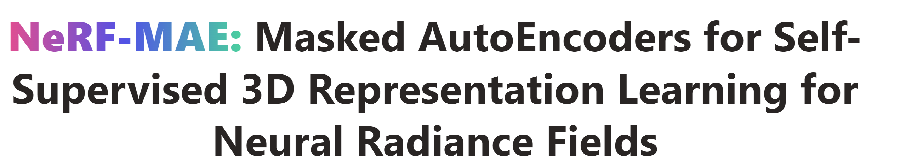
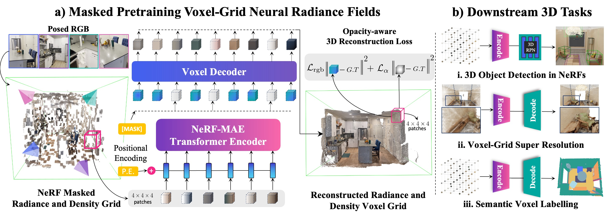
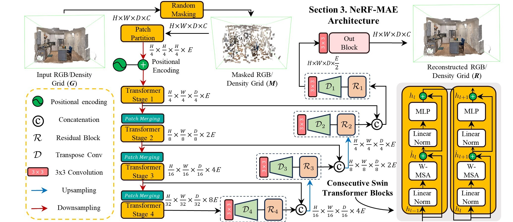
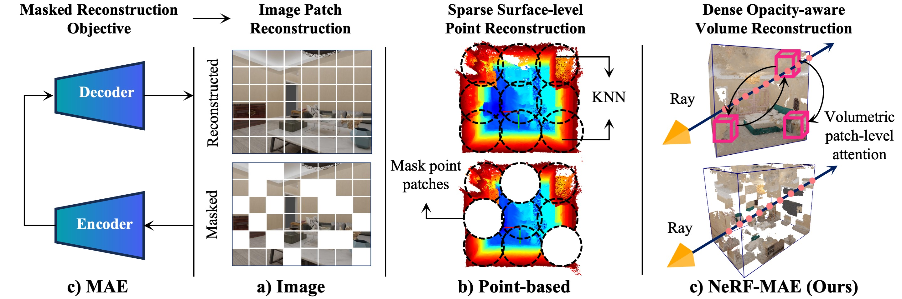

<!-- # NeRF-MAE: Masked AutoEncoders for Self-Supervised 3D Representation Learning for Neural Radiance Fields -->

<div align="center">
    
    
</div>
<!-- <p align="center">

</p> -->

<br>
<div align="center">

[](https://arxiv.org/abs/2404.01300)
[](https://nerf-mae.github.io)
[](https://pytorch.org/)
[](https://github.com/zubair-irshad/NeRF-MAE?tab=readme-ov-file#citation)
[](https://youtu.be/D60hlhmeuJI?si=d4RfHAwBJgLJXdKj)


</div>

---

<a href="https://www.tri.global/" target="_blank">
 
</a>

<a href="https://www.tri.global/" target="_blank">
 
</a>

### [Project Page](https://nerf-mae.github.io/) | [arXiv](https://arxiv.org/abs/2308.12967) | [PDF](https://arxiv.org/pdf/2308.12967.pdf)


**NeRF-MAE : Masked AutoEncoders for Self-Supervised 3D Representation Learning for Neural Radiance Fields**

<a href="https://zubairirshad.com"><strong>Muhammad Zubair Irshad</strong></a>
·
<a href="https://zakharos.github.io/"><strong>Sergey Zakharov</strong></a>
·
<a href="https://www.linkedin.com/in/vitorguizilini"><strong>Vitor Guizilini</strong></a>
·
<a href="https://adriengaidon.com/"><strong>Adrien Gaidon</strong></a>
·
<a href="https://faculty.cc.gatech.edu/~zk15/"><strong>Zsolt Kira</strong></a>
·
<a href="https://www.tri.global/about-us/dr-rares-ambrus"><strong>Rares Ambrus</strong></a>
<br> **European Conference on Computer Vision, ECCV 2024**<br>

<b> Toyota Research Institute &nbsp; | &nbsp; Georgia Institute of Technology</b>

## 💡 Highlights
- **NeRF-MAE**: The first large-scale pretraining utilizing Neural Radiance Fields (NeRF) as an input modality. We pretrain a single Transformer model on thousands of NeRFs for 3D representation learning.
- **NeRF-MAE Dataset**: A large-scale NeRF pretraining and downstream task finetuning dataset.

## 🏷️ TODO 

- [x] Release large-scale pretraining code 🚀
- [x] Release NeRF-MAE dataset comprising radiance and density grids 🚀
- [x] Release 3D object detection finetuning and eval code 🚀
- [ ] Pretrained NeRF-MAE checkpoints and out-of-the-box model usage
- [ ] Release multi-view rendered images and Instant-NGP checkpoints (totalling 1.6M+ posed images and 3200+ trained NeRF checkpoints)

## NeRF-MAE Model Architecture
<p align="center">

</p>

<!-- _________________ 


<p align="center">

</p> -->

## Citation

If you find this repository or our dataset useful, please star ⭐ this repository and consider citing 📝:

```
@inproceedings{irshad2024nerfmae,
    title={NeRF-MAE: Masked AutoEncoders for Self-Supervised 3D Representation Learning for Neural Radiance Fields},
    author={Muhammad Zubair Irshad and Sergey Zakharov and Vitor Guizilini and Adrien Gaidon and Zsolt Kira and Rares Ambrus},
    booktitle={European Conference on Computer Vision (ECCV)},
    year={2024}
    }
```

### Contents
 - [🌇  Environment](#-environment)
 - [⛳ Dataset](#-dataset)
 - [💫 Usage (Coming Soon)](#-usage)
 - [📉 Pretraining](#-pretraining)
 - [📊 Finetuning](#-finetuning)
 - [📌 FAQ](#-faq)

 ## 🌇  Environment

Create a python 3.7 virtual environment and install requirements:

```bash
cd $NeRF-MAE repo
conda create -n nerf-mae python=3.9
conda activate nerf-mae
pip install --upgrade pip
pip install -r requirements.txt
pip install torch==1.12.1+cu113 torchvision==0.13.1+cu113 -f https://download.pytorch.org/whl/torch_stable.html
```
The code was built and tested on **cuda 11.3**

Compile CUDA extension, to run downstream task finetuning, as described in [NeRF-RPN](https://github.com/lyclyc52/NeRF_RPN):

```bash
cd $NeRF-MAE repo
cd nerf_rpn/model/rotated_iou/cuda_op
python setup.py install
cd ../../../..

```

## ⛳ Dataset

Download the preprocessed datasets here. 

- Pretraining dataset (comprising NeRF radiance and density grids). [Download link](https://s3.amazonaws.com/tri-ml-public.s3.amazonaws.com/github/nerfmae/NeRF-MAE_pretrain.tar.gz)
- Finetuning dataset (comprising NeRF radiance and density grids and bounding box/semantic labelling annotations). [3D Object Detection (Provided by NeRF-RPN)](https://drive.google.com/drive/folders/1q2wwLi6tSXu1hbEkMyfAKKdEEGQKT6pj), [3D Semantic Segmentation (Coming Soon)](), [Voxel-Super Resolution (Coming Soon)]()


Extract pretraining and finetuning dataset under ```NeRF-MAE/datasets```. The directory structure should look like this:

```
NeRF-MAE
├── pretrain
│   ├── features
│   └── nerfmae_split.npz
└── finetune
    └── front3d_rpn_data
        ├── features
        ├── aabb
        └── obb
```


Note: The above datasets are all you need to train and evaluate our method. Bonus: we will be releasing our multi-view rendered posed RGB images from FRONT3D, HM3D and Hypersim as well as Instant-NGP trained checkpoints soon (these comprise over 1M+ images and 3k+ NeRF checkpoints)

Please note that our dataset was generated using the instruction from [NeRF-RPN](https://github.com/lyclyc52/NeRF_RPN) and [3D-CLR](https://vis-www.cs.umass.edu/3d-clr/). Please consider citing our work, NeRF-RPN and 3D-CLR if you find this dataset useful in your research. 

Please also note that our dataset uses [Front3D](https://arxiv.org/abs/2011.09127), [Habitat-Matterport3D](https://arxiv.org/abs/2109.08238), [HyperSim](https://github.com/apple/ml-hypersim) and [ScanNet](https://www.scan-net.org/) as the base version of the dataset i.e. we train a NeRF per scene and extract radiance and desnity grid as well as aligned NeRF-grid 3D annotations. Please read the term of use for each dataset if you want to utilize the posed multi-view images for each of these datasets. 

## 💫 Usage (Coming Soon)

NeRF-MAE (package: nerf-mae) is structured to provide easy access to pretrained NeRF-MAE models (and reproductions), to facilitate use for various downstream tasks. This is for extracting good visual features from NeRFs if you don't have resources for large-scale pretraining. Our pretraining provides an easy-to-access embedding of any NeRF scene, which can be used for a variety of downstream tasks in a straightforwaed way. Package, usage and our pretrained checkpoints are coming soon. 

<!-- Using a pretrained NeRF-MAE model is easy: Navigate to **nerf-mae** folder and run pretraining script.  -->

## 📉 Pretraining

Ofcourse, you can also pretrain your own NeRF-MAE models. Navigate to **nerf-mae** folder and run pretraining script. 

```
cd nerf-mae
bash train_mae3d.sh
```

Checkout **train_mae3d.sh** file for a complete list of all hyperparameters such as ```num_epochs```, ```lr```, ```masking_prob``` etc. 

Checkpoints will be saved at a regular interval of 200 epochs. For reproducing the paper results, we utilize the checkpoints at 1200 epochs.


**Notes**: 
1. with default settings i.e. ```batch_size 32``` and gpus ```0,1,2,3,4,5,6,7``` on ```A100``` GPU, the expected time it takes to pretrain is around 2 days. Please set these accoringly based on your machine's capacity.  

2. The dataset_name is set to default as ```dataset_name="nerfmae"```. This is for convenince for the dataloader as it describes the format. Our pretraining data comprises of scenes from Front3D, Habitat Matterport3D and Hypersim. 


## 📊 Finetuning

Our finetuning code is largely based on [NeRF-RPN](https://github.com/lyclyc52/NeRF_RPN). Infact, we use the same dataset as NeRF-RPN (unseen during pretraining), for finetuning. This makes sure our comparison with NeRF-RPN is based on the same architecture, the only difference is the network weights are started from scratch for NeRF-RPN, whereas in our case, we start with our pretrained network weights. Please see our paper for more details.

**Note**: We do not see ScanNet dataset during our pretraining. ScanNet 3D OBB prediction finetuning is a challenging case of cross-dataset transfer. 


### 3D Object Detection
Navigate to **nerf-rpn** folder and run finetuning script. 

To run 3D Swin Transformer + FPN model finetuning with our pretrained weights:

```
cd nerf-rpn
bash train_fcos_pretrained.sh
```

To train the 3D Swin Transformer + FPN model model with weights started from scratch:

```
cd nerf-rpn
bash train_fcos.sh
```

**Note**: only 3D Swin Transformer weights are started from our pretraining. FPN weights for both cases are started from scratch. For evaluating our pretrained weights or finetuning from scratch, use ```bash test_fcos_pretrained.sh``` or ```bash test_fcos.sh```

Checkout **train_fcos_pretraining.sh** and ***test_fcos_pretrained.sh*** file for a complete list of all hyperparameters such as ```mae_checkpoint```, ```num_epochs```, ```lr```, ```masking_prob``` etc. Code for finetuning and eval for our downstream tasks are based on [NeRF-RPN's](https://github.com/lyclyc52/NeRF_RPN) implementation.

## Acknowledgments
This code is built upon the implementation from [NeRF-RPN](https://github.com/lyclyc52/NeRF_RPN). We appreciate the authors for releasing their open-source implementation. 

## Licenses
This repository and dataset is released under the [CC BY-NC 4.0](https://github.com/zubair-irshad/NeO-360/blob/master/LICENSE.md) license.