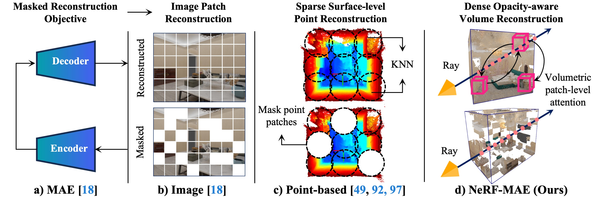

# NeRF-MAE: Masked AutoEncoders for Self-Supervised 3D representation Learning for Neural Radiance Fields

This repository is the pytorch implementation of our paper, **NeRF-MAE** (Code Coming Soon!)

### [Project Page](https://nerf-mae.github.io/) | [arXiv](https://arxiv.org/abs/2308.12967) | [PDF](https://arxiv.org/pdf/2308.12967.pdf)

**NeRF-MAE: Masked AutoEncoders for Self-Supervised 3D representation Learning for Neural Radiance Fields**

<a href="https://zubairirshad.com"><strong>Muhammad Zubair Irshad</strong></a>
·
<a href="https://zakharos.github.io/"><strong>Sergey Zakharov</strong></a>
·
<a href="https://www.linkedin.com/in/vitorguizilini"><strong>Vitor Guizilini</strong></a>
·
<a href="https://adriengaidon.com/"><strong>Adrien Gaidon</strong></a>
·
<a href="https://faculty.cc.gatech.edu/~zk15/"><strong>Zsolt Kira</strong></a>
·
<a href="https://www.tri.global/about-us/dr-rares-ambrus"><strong>Rares Ambrus</strong></a>
  Preprint, 2024 

<b> Toyota Research Institute &nbsp; | &nbsp;   Georgia Institute of Technology</b>

_________________ 

